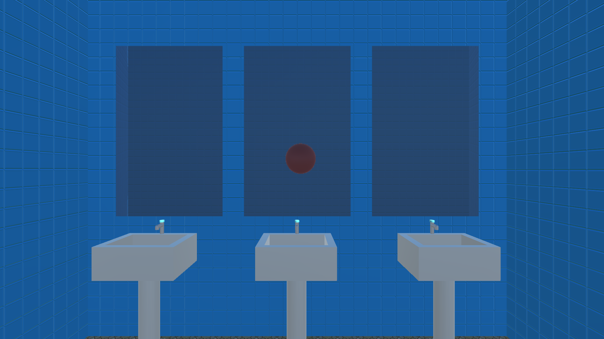
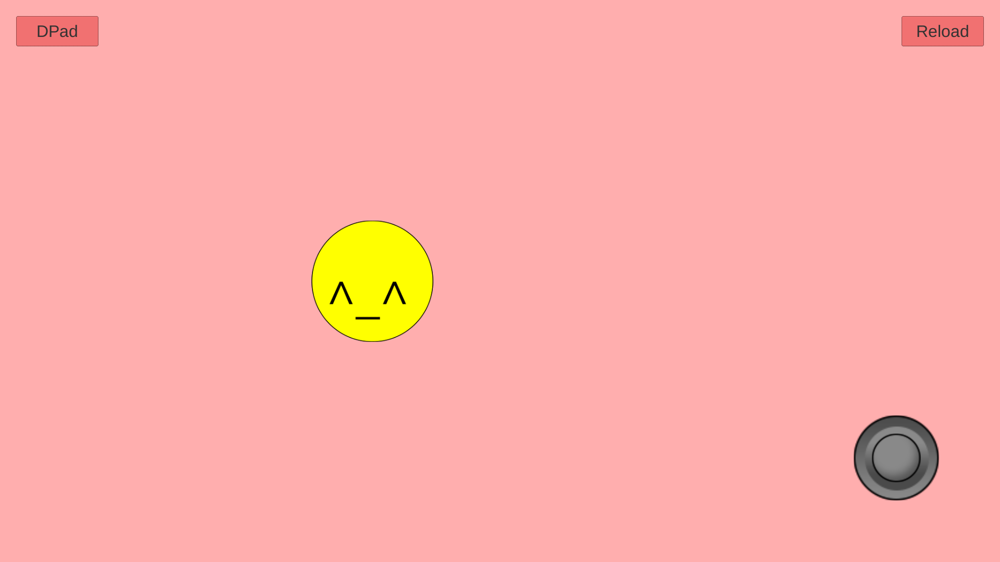
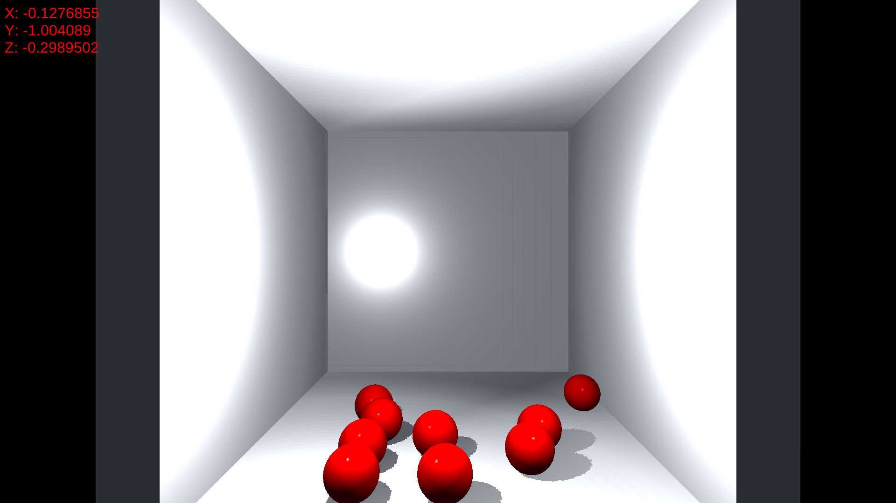
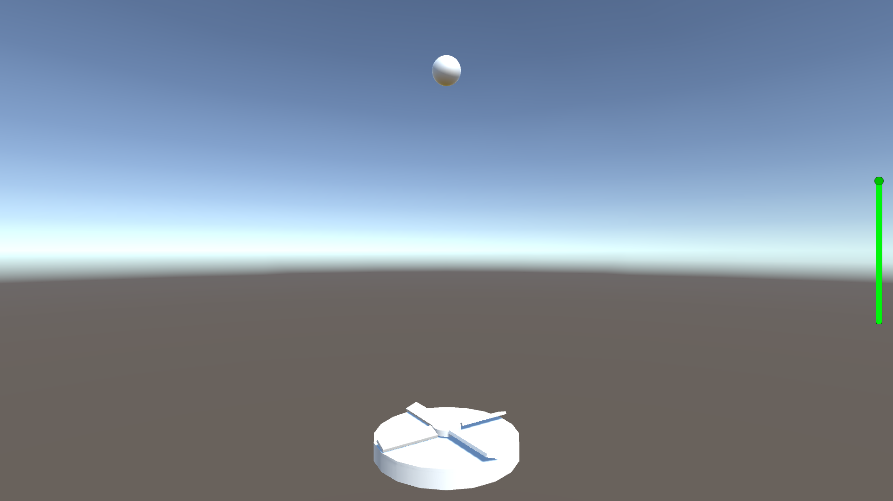
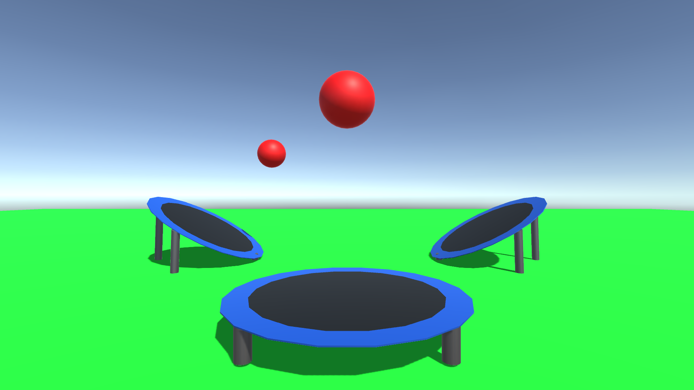
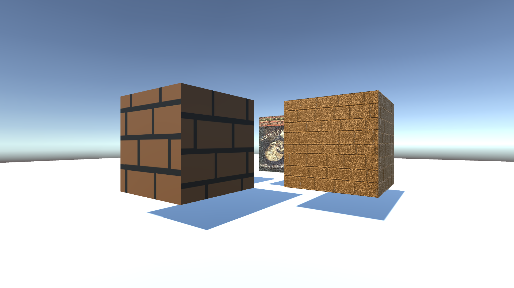
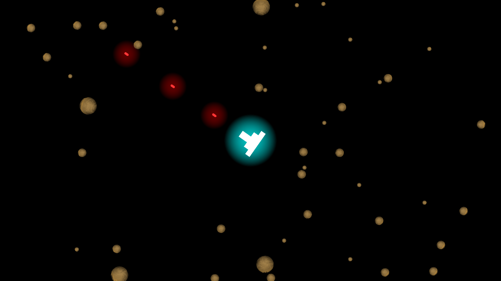
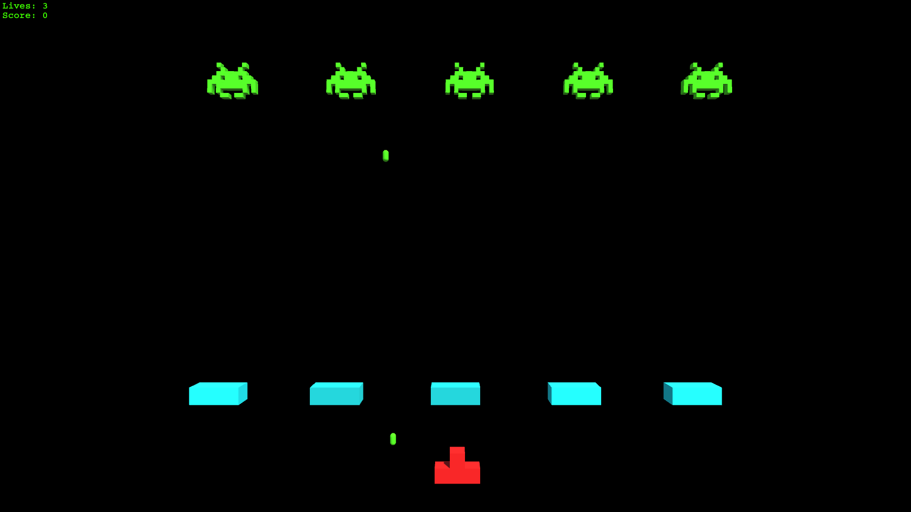
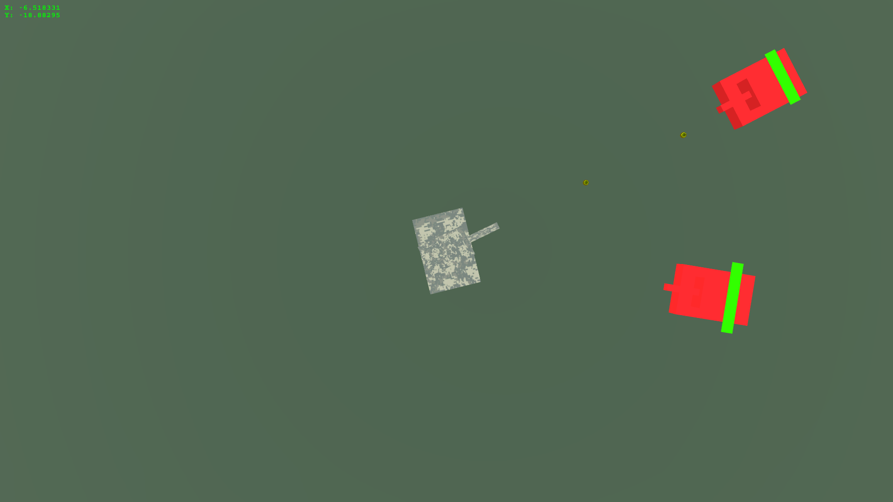
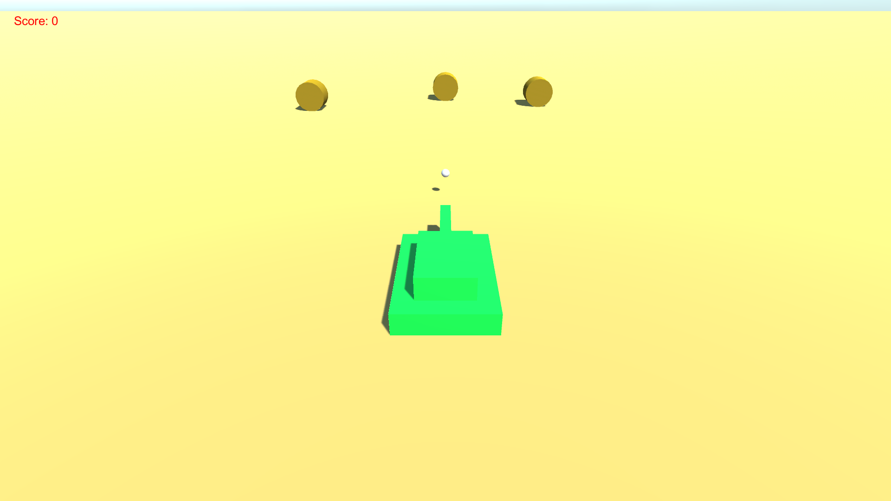

# Unity Examples

This is a collection of some useful examples and tutorials I created teaching
Unity in Summer 2015. These example are great sources for some of the most 
common questions and problems encountered while starting to use Unity. Feel 
free to expand and create upon them as needed.

## Examples

### Audio

A collection of common audio applications. Covers topics from simple sound 
effects to looping background music.

### Camera

Some more complex (and "experimental") utilizations of the camera(s) in a 3D 
game world. Topics covered include: mini-maps, camera zooming, and mirroring 
(Mesh Renders).

### Cross Platform Input

Example uses of touch screen controls to interact with the game world. Includes 
an example uses of joysticks, direction pads, and buttons. 

(**Note**: These inputs and sprites are of my own creation and differ from the 
standard asset versions, so they may contain a couple of bugs) 

### Enemy Follow

A useful script for having a GameObject follow another GameObject's transform. 
The script also includes parameters for a target tag, speed to follow at, and a
minimum distance away from the target to start following. Note this is a simple 
move towards script and, therefore, has no path finding or obstacle avoidance.

This example also includes a simple 2D game where the player evades an enemy 
chasing after them.

(**Note**: This is an original script, if any bugs are found please report them.) 

### GravityBox

An example using the accelerometer of a phone or mobile device to move and 
control objects. In this example, the game world contains several spheres and 
the accelerometer controlling the direction of gravity. This effectivly creates 
a simulated 3D environment that is affected by the real world.

### Packages 

An example world created using the standard packages included in Unity. A great 
example of what Unity is capable of and what can be created using just the 
standard assets.

### Physics

These examples contains some of the most useful aspects of Unity's realistic 
physics. Contained are examples uses of forces, rigid bodies, collision 
detection, triggers, and more physical properties.

### Textures

This is an example of many common in engine texturing abilities. Demonstrates 
how to use materials and textures to change the appearance of primitive game 
objects. Also shows how to use normal mappings to create more realistic 3D 
objects and worlds.

## Games

### Asteroids

The classics arcade game recreated in Unity. A top-down 3D game controlled by 
keyboard input, this game is a great starting point for a space-ship shooter.

### Space Invaders

Another classic game recreated using Unity. Containg many different elements, 
this game is a goto when first learning, or teaching, Unity. It covers important 
aspects of game creation incuding controls, spawning prefabs, collision 
detection, and simple enemy AI.

### Tanks and Tanks3rdPerson

These are a pair of example tank games that can be used to learn physics based 
movements and mouse assisted aiming. Tanks is a top down version and 
Tanks3rdPerson is, as the name implies, a third person version. These examples 
are great for learning about simple movement using keyboard controls, and 
more complex controls using a mouse and ray casting to aim.

## Packages

The `Packages` directory contains a couple of unity packages of custom-created 
prefabs.

* Bathroom - A prefab of a simple bathroom containing sinks and mirrors.
* CubeRoom - A useful prefab of a cubed room.
* Joystick - A custom created joystick prefab. Contains both the script and 
sprite
* Sink - A sink prefab consisting of primitive 3D objects.

If you have any questions about these examples or teaching Unity to first time 
students feel free to contact me.
